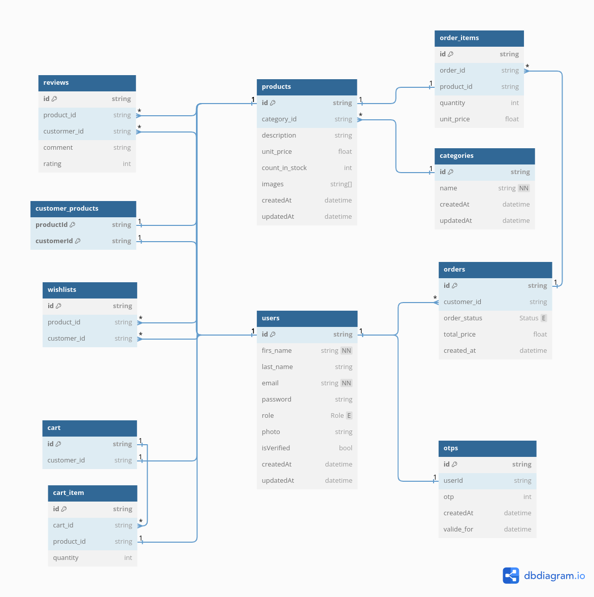
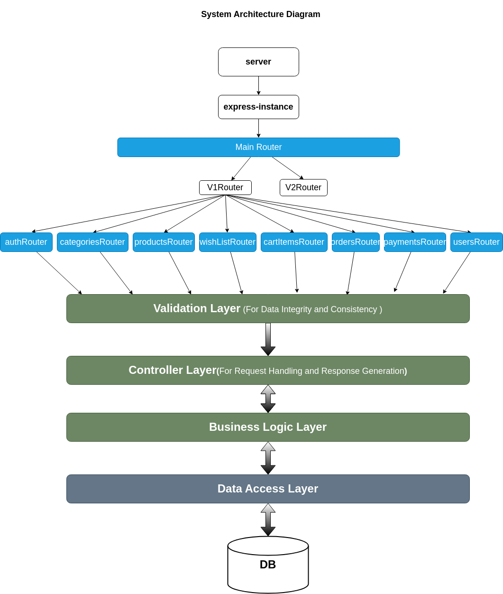

# Online Store System

## Table of Contents

- [Online Store System](#online-store-system)
  - [Table of Contents](#table-of-contents)
  - [Introduction](#introduction)
  - [Requirements](#requirements)
  - [Future Enhancements](#future-enhancements)
  - [Entity Relationship Diagram](#entity-relationship-diagram)
  - [Database schema](#database-schema)
  - [App Architecture](#app-architecture)
  - [API Endpoints](#api-endpoints)
  - [Technology Stack](#technology-stack)
  - [Installation and Setup](#installation-and-setup)
  - [Credit](#credit)
  - [References](#references)
  - [Contributing](#contributing)
  - [License](#license)

## Introduction

The Online Store System is a web-based API designed to facilitate the buying and selling of products over the internet. This platform offers a convenient and efficient way for customers to browse, select, purchase, and receive products. It supports functionalities such as product catalogue display, shopping cart management, checkout process, order management, and user authentication, catering to both admin (vendor) and customer roles.

This API serves as a backend service (SaaS) for front-end applications to integrate with and manage online store functionalities.

[](#technology-stack)

## Requirements

-   ### Functional Requirements
    -   #### User Requirements
        -   [x] Customers should be able to register and login to their accounts.
        -   [x] Customers should be able to browse products, view product details, and add them to the shopping cart.
        -   [x] Customers should be able to add products to the wishlist.
        -   [x] Customers should be able to manage their shopping cart by adding, removing, or updating product quantities.
        -   [x] Customers should be able to proceed to checkout, provide billing information, and place orders.
        -   [x] Customers should be able to add review to the products they purchased.
        -   [x] Customers should be able to view their order history.
    -   ### System Requirements
        -   [x] Admin users should be able to login to the system with special privileges.
        -   [x] Admin users should be able to manage categories and products by adding, editing, or deleting them.
        -   [x] Admin users should be able to view orders placed by customers.
        -   [x] The system should integrate with a payment gateway for secure payment processing.
        -   [ ] The system should provide feedback to users during the checkout process (e.g., order confirmation, payment confirmation).
-   ### Non-Functional Requirement

    -   [x] The system should offer a user-friendly and intuitive interface for customers to register easily and browse products seamlessly.
    -   [x] Product images should be optimized for fast loading times without sacrificing quality.

    -   [x] Customer email addresses should be verified during registration using OTP (One-Time Password) sent via email to ensure the validity of accounts and enhance security.
    -   [ ] The email verification process should be user-friendly and seamless, providing clear instructions and easy-to-follow steps for customers to confirm their email addresses.

## Future Enhancements

-   [ ] Add endpoint for password reset and update.
-   [ ] Integrate Swagger for API documentation.
-   [ ] Perform code refactoring for improved maintainability.
-   [ ] Add endpoints for the admin dashboard
-   [ ] Contenarize the application using Docker.

## Entity Relationship Diagram


## Database schema



## App Architecture



## API Endpoints

For detailed API endpoint descriptions and examples, please refer to the [API Documentation](https://documenter.getpostman.com/view/30739769/2sA3JT1xUP).

## Technology Stack

-   **_Backend_**: Node.js, Express ,TypeScript.

-   **_Database_**: PostgreSQL, Prisma(ORM).

-   **_Authentication_**: JWT , Bcrypt, Passport.

-   **_Email_**: Nodemailer , MailTrap(For Development), Brevo(For Production).

-   **_Storage_**: Multer,Cloudinary (Could be any other cloud storage, the application is designed to be flexible).

-   **_File Uploads:_** Multer.

-   **_Rate Limiting:_** express-rate-limit.

-   **_Environment Variables:_** dotenv.

-   **_Validation:_** Joi.

-   **_Payment Processing:_** Stripe.

## Installation and Setup

-   Clone the repository

```bash
   git clone https://github.com/MohamedAboElnaser/online-store.git
   cd online-store
```

-   Install dependencies

```bash
  yarn install
```

-   Set up environment variables

    -   Rename the `.env.example` file to `.env`
    -   Fill out the `.env` file with the needed variables

-   Migrate prisma schema and run seed command

```bash
    yarn run migrate
```

-   Run the application in dev mode:

```bash
 yarn run dev
```

## Credit

-   I would like to thank my friend [Mahmoud Gadallah](https://github.com/m7moudGadallah) for his invaluable assistance in implementing the [validation](./src/api/middlewares/validator.middleware.ts) layer in this project.

## References

-   [Problem Statement](https://docs.google.com/document/d/1LLX6J_P2wlqWMwo56_2eSakXH4iKeKmLXIt5SgO2JM0/edit?usp=drive_link)
-   [Requirements Document](https://docs.google.com/document/d/1ZwMnRgLLUb8ZmEAGxfnNQIgiJQ8NhxQEiLg-Bwl_6no/edit?usp=drive_link)

## Contributing

Contributions are welcome! Please fork the repository and submit a pull request for any enhancements or bug fixes.

## License

This project is licensed under the MIT License. See the [LICENSE](/LICENCE) file for details.
